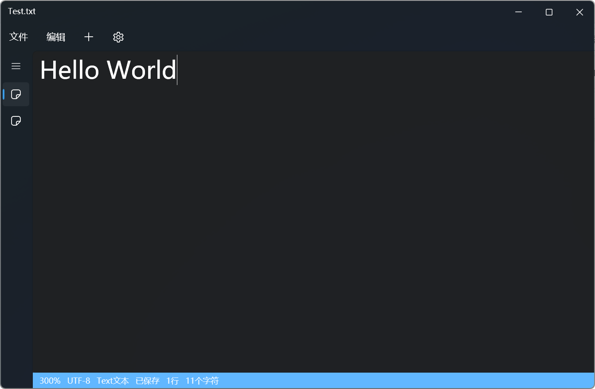
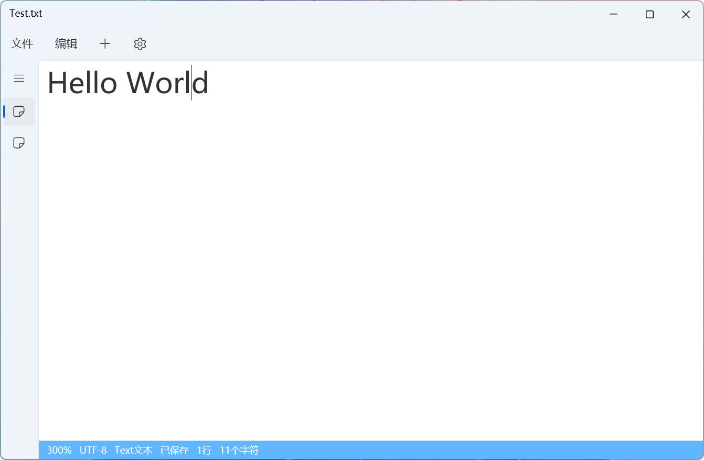
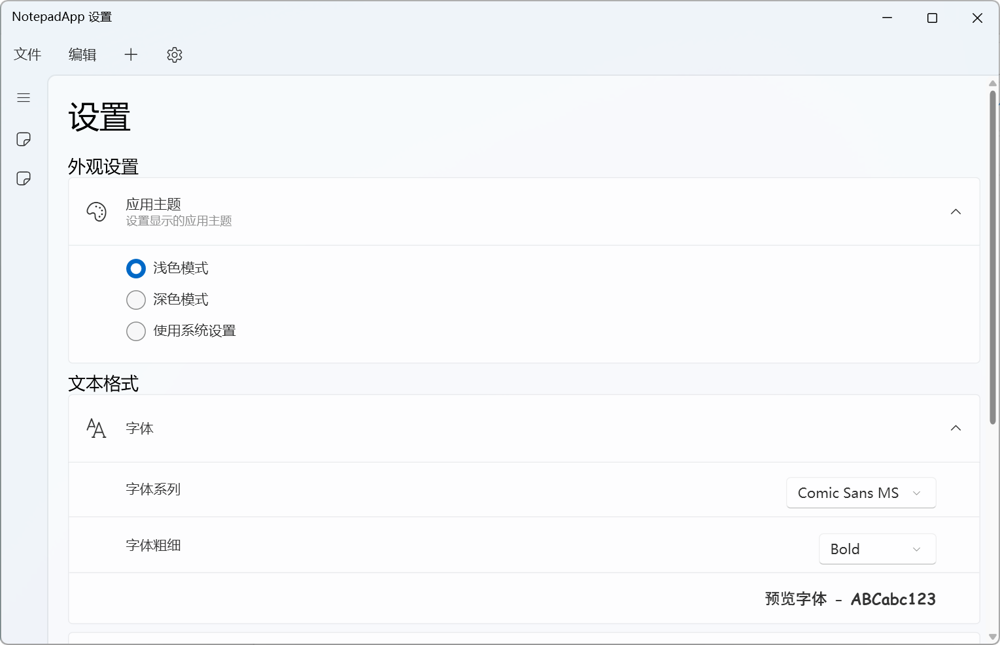

# NotepadApp
## Introduce | 介绍
* NotepadApp is a powerful Notepad next-generation that helps users enjoy better features on top of the original Notepad. Use the sidebar tab to manage open files, with more information in detail in the bottom bar, which is faster than the original Notepad, and supports code highlighting for different file types, such as C#, Python, C, Java, etc.
 
* NotepadApp 是功能强大的下一代记事本，可帮助用户在原始记事本之上享受更好的功能。使用侧边栏选项卡管理打开的文件，底部栏中有更详细的信息，这比原来的记事本更快，并支持不同文件类型的代码高亮，如 C#、Python、C、Java 等。

## Developers | 开发者
- [Sm4Z0n3](https://github.com/SmaZone2020)

## Open source projects used | 使用的开源项目
- [iNKORE.UI.WPF.Modern](https://github.com/iNKORE-NET/UI.WPF.Modern)
- [Newtonsoft.Json](https://www.newtonsoft.com/json)